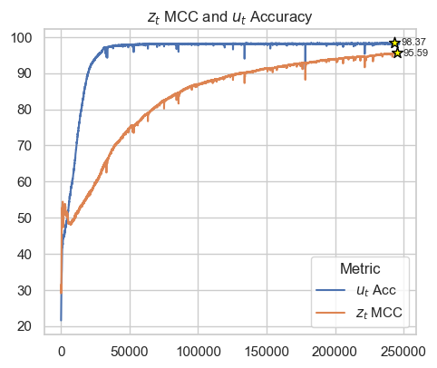

# Code for CtrlNS: Causal Temporal Representation Learning with Nonstationary Sparse Dynamics

## First install the required packages
```bash
conda create -n ctrlns python=3.11
conda activate ctrlns
pip install -r requirements.txt
```

## Generate synthetic data
The data used in the paper is already generated in the `datasets` folder. If you want to generate the data yourself, you can follow the following steps.
```bash
cd datasets
python generate_data.py
```
The default parameters will generate a synthetic dataset used in paper. You can change the configurations by changing the values in [`datasets/generate_data.py`](datasets/generate_data.py) file.

## Run the synthetic experiments
To run the experiments, you can use the following steps. Make sure you have a GPU available for training the models.

### HMM model cannot handle complex nonstationary dynamics
To see the HMM model cannot handle complex nonstationary dynamics, you can run the following command:
```bash
python train_hmm.py
```
It is expected to see the HMM doesn't converge and make the optimization problem unstable.

### Identifiable result for $u_t$ when directly accessing latent variables $z_t$ (First part in Theorem 1)
To see the identifiable result for $u_t$ when directly accessing latent variables $z_t$, you can run the following command:
```bash
python train_nsctrl_z.py
```

You will find accuracy achieves >95% for estimating the latent variables $u_t$.

### Identifiable result for $u_t$ jointly with $z_t$ (Second part in Theorem 1 and Theorem 2)

Theorem 1 indicates we can accurately estimate $u_t$ even if our estimation of $z_t$ is not perfect. To see this, you can run the following command:
```bash
python train_nsctrl.py
```
You will find the MCC and Acc curve looks similar to the following one.



We can see at first the $u_t$ estimation is not perfect, hence the MCC for $z_t$ is not increasing, which is the failure example of using nonlinear ICA model without considering nonstationary dynamics. 

Later on the Acc for estimating $u_t$ is increasing, even thought the estimation of $z_t$ is not perfect (Theorem 1). 

Finally with accurate estimation of $u_t$, the estimation of $z_t$ is also accurate (Theorem 2).

## Real-world experiments
See the [`real_world_exp`](./real_world_exp/) folder for the real-world experiments.